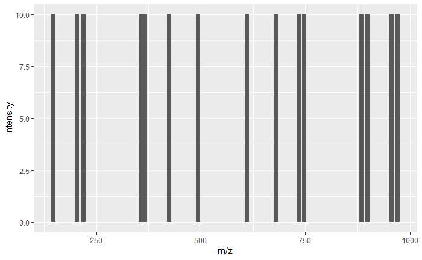

Proteomics is the large-scale study of proteins (from Wiki :-)). Any -omics is basically large-scale study of a particular biomolecule under study. More examples: Large-scale study of metabolome(s) is metabolomics, large-scale study of lipids is lipidomics and so on. Some of these molecules (or bio-molecules) i.e., lipids, metabolites, proteins can be  quantified using mass-spectrometer. As the names says, the mass-spectrometer measures the mass using properties of ionized molecules!

To analyze the output of mass-spectrometers, we need a program. [OMSSA](https://pubchem.ncbi.nlm.nih.gov/omssa/) is one such tool developed by Lewis Geer at NCBI, National Institutes of Health. This program analyzes the data using sophisticated algorithm to eventually identify the protein. There are other softwares/programs to analyze other molecules i.e., metabolites, lipids. Also, there are multiple other software programs to analyze proteins, such as [Byonic](https://www.proteinmetrics.com/products/byonic/), MODa, [PEAKS](http://www.bioinfor.com/), [pFind3](http://pfind.ict.ac.cn/software/pFind3/index.html), X!TANDEM, [SearchGUI](http://compomics.github.io/projects/searchgui.html) and the list goes on. Here, let's focus on OMSSA as I used this tool in the past.

Review on mass-spectrometry based proteomics: [This](https://www.ncbi.nlm.nih.gov/pubmed/12634793) is an article by Ruedi Aebersold and Mathias Mann.   


OMSSA can be downloaded [here](https://pubchem.ncbi.nlm.nih.gov/omssa/)  
[Link to publication on OMSSA](https://www.ncbi.nlm.nih.gov/pubmed/15473683)  

OMSSA download folder has a sample data file (*.dta) for testing. The data that can be analyzed has many formats, and there are many instrument vendors complicating this. However there are some standard data formats such as mzML, mzXML (for example), that can be analyzed by any software and there are tools out there to convert raw data to this format!

Let's look at what is available in OMSSA download:


```console
 Directory of C:\OMSSA\omssa-2.1.9.win32

02/21/2019  12:14 PM    <DIR>          .
02/21/2019  12:14 PM    <DIR>          ..
02/21/2019  12:14 PM    <DIR>          contrib
12/06/2010  01:31 PM             2,444 disclaimer.txt
12/06/2010  01:31 PM           113,946 mods.xml
12/06/2010  01:31 PM               159 MSHHWGYGK.dta
12/06/2010  01:31 PM           554,832 msvcp80.dll
12/06/2010  01:31 PM           632,656 msvcr80.dll
12/06/2010  01:31 PM            73,134 OMSSA.xsd
12/06/2010  01:31 PM         2,551,808 omssa2pepXML.exe
12/06/2010  01:31 PM         2,953,216 omssacl.exe
12/06/2010  01:31 PM         2,457,600 omssamerge.exe
12/06/2010  01:31 PM            15,584 usermods.xml
              10 File(s)      9,355,379 bytes
               3 Dir(s)  817,232,166,912 bytes free

C:\OMSSA\omssa-2.1.9.win32>
```

Here omssacl.exe is the core script that processes raw data to identify protein. MSHHWGYGK.dta is a sample data file. Simply put, this .dta mass-spectra file has peaks. If you plot this, X-axis is mass (specifically mass/charge - measure of charged ions) and y-axis is counts (i.e., how many times the instrument sees this mass). Let's look at the .dta file.

```console
C:\OMSSA\omssa-2.1.9.win32>cat MSHHWGYGK.dta
1102.5 1
147.11 10
204.13 10
219.08 10
356.14 10
367.20 10
424.22 10
493.20 10
610.30 10
679.28 10
736.30 10
747.36 10
884.42 10
899.36 10
956.38 10
971.45 10
```
1st column are the masses and the 2nd column (except the first line) are the counts. For simplicity, all peaks have the same counts i.e, 10.

Let's plot this with R. Let's go in details about ggplot later.


```r
library(ggplot2) # Tool to plot in R
peptide_peaks = read.csv("./MSHHWGYGK.dta", header = FALSE, sep =" ")
peptide_mass = peptide_peaks[1,1]*peptide_peaks[1,2] # 1st column elements
peptide_peaks = peptide_peaks[-1,]
ggplot(data = peptide_peaks, aes(x=V1, y=V2)) + geom_bar(stat="identity") + labs(x="m/z", y = "Intensity")
```



Mass-spectrometer generates tons of such .dta files and the goal of the program is to identify all the proteins it sees in the raw data. Since proteins are huge (on average 400 amino acids), these are cut into small pieces called peptides, which are then sent into the mass-spec. Small pieces would allow for better ionization and hence better identification.

Mass-spec cleaves the peptide further. Let's say the peptide is MSHHWGYGK. Mass-spec uses fragmentation technique to break these further into even smaller sub-units i.e., M, MS, MSH, ... also from the opposite end, K, KG, KGY .. and so on. (The figure above shows the masses of these pieces M, MS, MSH,....... KGY, KG, K from oppsoite end).

So, the goal of the software is to find these small pieces M, MS, then stitch them to MSHHWGYGK and use background information to see which protein does the peptide (MSHHWGYGK) match to. This background information is generally given to the program in the form of a fasta file, or a formatted fasta file in the case of OMSSA using makeblastdb.

All this can be found in my [git repo](https://github.com/viswam78/searchOMSSA/tree/master/OMSSA_setup)  
Different variants of the fasta file, such as CA2.fasta.p* are the files created by makeblastdb. This goes as input to OMSSA as well.  


Let's run the program (finally!)

```console
omssacl -i 1,4 -mf 3 -mv 1 -f MSHHWGYGK.dta -d CA2.fasta -oc omssa_sample.csv
```

More info on the arguments used can be found from the above links or using omssa help file. [More info here](http://proteomicsresource.washington.edu/tools/omssa.php). Some arguments give specific information about how the sample is prepared. Other arguments tell about the mass-spectrometer characteristics e.g., what fragmentation technique.

Since this is a very simple input, the output if everything goes right looks something like this.
Truncated output from above run
MSHHWGYGK | 2.61923815969567e-008 | 1101.493 | sp|P00918.2|CAH2_HUMAN RecName:

This means that the peak list, matched to "MSHHWGYGK" (matches the file name as well, so highly likely it is correct!). Very low E-value of 2.6e-8 also confirms the answer is correct! The peptide has mass of 1101.5 (dalton), which seem to match well to the first column of the .dta file.

From the fasta file, the program matches the peptide to CAH2_HUMAN RecName.
Probably soon, I will dive into some large-scale data and also start looking at other software.
