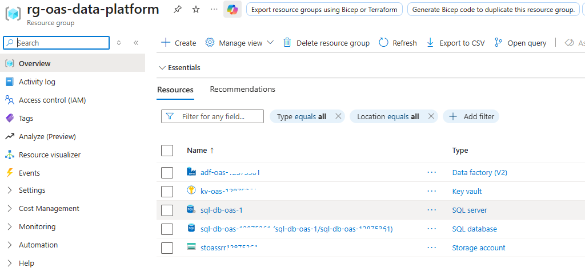
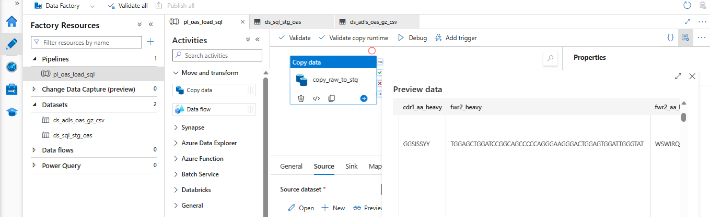
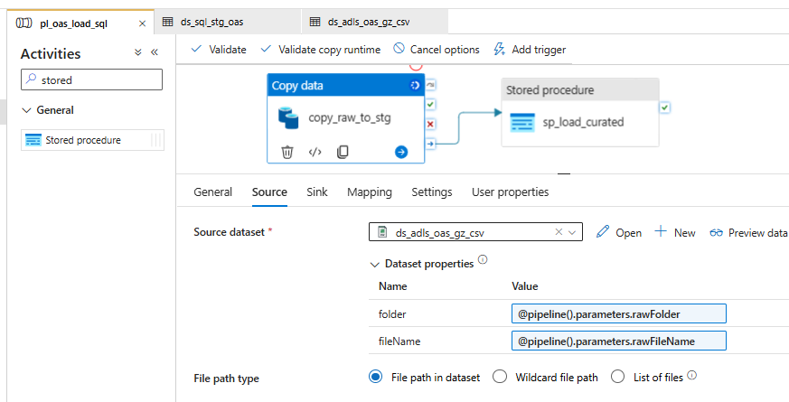
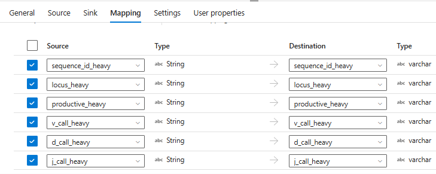

Most of my career has been on the science side of data: pipelines, reproducibility and getting the biology right. Increasingly, the questions I am asked are architectural: where does the data live, who can access it, and what happens when something fails? To work through those questions in the open, I built a small platform on Azure using real antibody repertoire data from the Observed Antibody Space (OAS).

This post covers the build up to the SQL layer: the Azure resources, the dataset, and how a raw `.csv.gz` file becomes curated SQL tables through Azure Data Factory (ADF). Monitoring, the dashboard and infrastructure-as-code will follow in later posts. This is a portfolio project on public research data, not a production or regulated system.  

  

```
OAS data unit (.csv.gz)
      |
      v
ADLS Gen2   raw zone        <- original file, immutable
      |
      v   ADF Copy activity (parameterized, explicit mapping)
Azure SQL   staging table   <- all text
      |
      v   Stored procedure (typing, cleaning, idempotent load, quality metrics)
Azure SQL   curated table   <- typed, traceable to the pipeline run
```

Figure 1:  From raw OAS csv.gz to SQL tables
## 1. Resources used

Everything lives in one resource group, which keeps access, cost and cleanup easy to reason about.  
  

  
  
Figure 2: *The resource group `rg-oas-data-platform` and its five resources (identifiers masked).*

| Resource | Name | Role in the design |
|---|---|---|
| Storage account (ADLS Gen2) | `stoassr<id>` | Data lake with `raw`, `curated`, `analytics` and `archive` zones; hierarchical namespace, LRS, no anonymous access |
| Data factory (V2) | `adf-oas-<id>` | Orchestration and data movement |
| Key vault | `kv-oas-<id>` | Holds the SQL credential, Azure RBAC permission model |
| SQL server | `sql-db-oas-<n>` | Logical server for the database |
| SQL database | `sql-db-oas-<id>` | Staging and curated layers; free serverless tier with auto-pause |

Three design choices matter more than the services themselves:

- **Identity over secrets.** The factory's system-assigned managed identity holds *Storage Blob Data Contributor* on the lake and *Key Vault Secrets User* on the vault. Data access does not rely on storage account keys, and the SQL linked service holds only a reference to a Key Vault secret. Managed identity to SQL is the natural next hardening step.
- **Zones as contracts.** `raw` is immutable and exactly as received, so any downstream logic can be changed and replayed without re-acquiring the data. Curated and analytics layers can be rebuilt from it.
- **Demo vs. production.** I used public endpoints with a client-IP rule on SQL, which is acceptable for a short-lived demo. In production I would use private endpoints, VNet integration, per-environment identities and co-located resources to limit latency and egress cost.

## 2. The dataset

The data is one paired data unit from OAS: run SRR12875361 from Mor et al., 2021 (human PBMC B cells, SARS-CoV-2, Patient-2; about 4,162 filtered sequences; CC-BY 4.0).

For readers outside bioinformatics: antibodies are built from a heavy and a light chain, and OAS "paired" files keep both chains of each cell on one row. Each chain carries V, D and J gene calls, CDR and framework regions, productivity flags and annotation status, as both nucleotide and amino-acid fields.

For architects, the interesting properties are structural rather than volumetric:

- **Wide.** Far more columns than any one analysis needs, for only a few thousand rows.
- **Semantically loaded text.** Gene calls carry allele suffixes (`IGHV3-23*01`), flags arrive as `T`/`F`, and numeric lengths can arrive as text.
- **Non-standard file structure.** The file has a preamble before the real header, so a default CSV reader mis-parses it.

That combination argues for explicit schema control rather than schema inference, which shapes the rest of the design.

## 3. From raw csv.gz to SQL tables

### Two SQL layers with different jobs

- **Staging** is a landing table where every column is text. Letting the copy activity convert types on the way in turns a stray empty value or a number written as `15.0` into a failed pipeline. Loading as text keeps ingestion robust and moves type decisions to where they can be handled gracefully.
- **Curated** holds typed columns (`BIT` productivity flags, `INT` lengths, a derived V-gene column) plus provenance: data unit, source run, source file, load run ID and load timestamp.

A small quality-summary table and a load-audit table (rows staged versus rows inserted, per run) support the operational story in a later post.

### Linked services and datasets in ADF Studio

Three linked services: **Key Vault** and **ADLS Gen2** (both via the managed identity) and **Azure SQL** (password pulled from the Key Vault secret at runtime).

Two datasets describe the movement. The source, `ds_adls_oas_gz_csv`, reads the gzip file directly from the lake with `folder` and `fileName` exposed as dataset parameters. The sink, `ds_sql_stg_oas`, is the staging table.  
  

  
  
Figure 3: *ADF Studio: the factory resources (one pipeline, two datasets) and the source preview, showing OAS annotation columns such as `cdr1_aa_heavy` and `fwr2_heavy`.*

The Preview data pane doubles as the cheapest integration test: before running anything, it confirms the dataset settings parse the file into the real column set.

### One parameterized pipeline

`pl_oas_load_sql` has two activities in sequence and four parameters (`dataUnit`, `sourceRun`, `rawFolder`, `rawFileName`). Nothing is hard-coded, so loading another OAS data unit is a parameter change, not a new pipeline.  
  

  
  
Figure 4: *`pl_oas_load_sql`: `copy_raw_to_stg` followed by `sp_load_curated`, with the dataset's folder and file name bound to pipeline parameters.*

**`copy_raw_to_stg` (Copy data)**

- The source dataset's `folder` and `fileName` are bound to `@pipeline().parameters.rawFolder` and `rawFileName`.
- The sink has a pre-copy script, `TRUNCATE TABLE dbo.stg_oas_paired`, so each run starts from a clean staging table and reruns never accumulate stale rows.
- Retry is set to 2 with a 60-second interval. A serverless database that has auto-paused can take some time to resume (roughly a minute in my testing), so the first connection can fail for reasons unrelated to the data.

**`sp_load_curated` (Stored procedure)** runs only if the copy succeeds. It receives the data unit, source run, source file and `@pipeline().RunId`, so every curated row is traceable to the exact run that produced it. Inside, it types and cleans the staged data, loads the curated table idempotently (a rerun is designed not to duplicate rows) and records quality metrics and an audit entry.

### Explicit mapping: narrowing a wide file

Rather than mapping every column in the source, the Copy activity maps only 19 fields: sequence IDs, locus, productivity, V/D/J calls, CDR3 and annotation status for both chains.  
  

  
  
Figure 5: *Mapping tab: source columns (string) mapped by name to staging columns (varchar).*

This is a deliberate trade-off. Schema inference is faster to set up, but explicit mapping keeps the model small and explainable, and it makes schema drift visible. If the provider renames a column, the copy fails loudly instead of silently loading the wrong data, and because the raw file is immutable, the source is preserved while the mapping is fixed.

## What comes next

The next posts move from building to operating the platform on Azure:

- **Observability:** routing Data Factory diagnostics to Log Analytics, querying pipeline and activity runs with KQL, and wiring an Azure Monitor alert.
- **Reliability:** an intentional failure to verify that the alert fires and that a corrected rerun recovers cleanly.
- **Infrastructure as code:** exporting and cleaning the environment as Bicep.
- **Lifecycle and cost:** publishing a static output and the supporting evidence so the work remains available after the temporary Azure environment is retired.

*Data: Observed Antibody Space (Oxford Protein Informatics Group), Mor et al., 2021, CC-BY 4.0. See the OAS website for the full citation. This is a personal project and is unrelated to any employer or agency system.*
